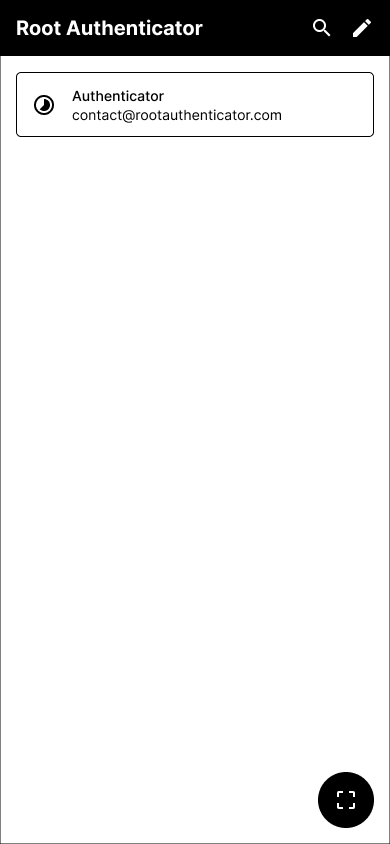
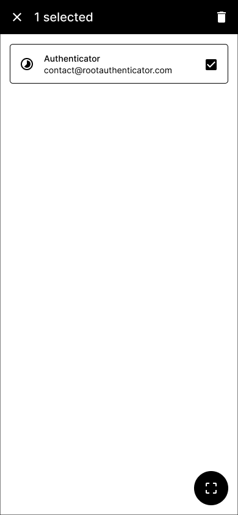
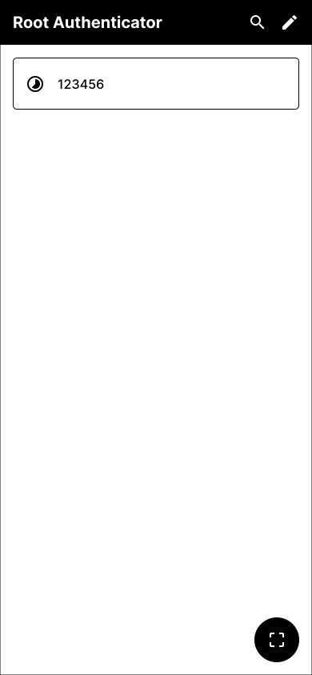

# Root Authenticator

[](https://securityscorecards.dev/viewer/?uri=github.com/rootauthenticator/authenticator-mobile)

Root Authenticator is an open source two-factor authentication mobile application for systems utilizing one-time password (OTP) protocols.

Root Authenticator supports:

- HOTP & TOTP
- Multiple accounts
- QR code scanning
- Filter
- Encryption
- Dark theme

# Screenshots

  

# Requirements

- Android 8.0+
- iOS 13.4+

# User agreement

Upon installing the app, you are acknowledging that we maintain a count of installations. As we are not available on the Google Play Store and the Apple App Store, this count is important for us. Your understanding and support are greatly appreciated.

# How to install on Android/Samsung

Download the .apk file from the [releases section](https://github.com/rootauthenticator/authenticator-mobile/releases) of this repository and open it on your phone.

# How to install on iPhone/iPad

Installation can be performed using [Sideloadly](https://sideloadly.io). Follow these steps:

- Download the .ipa file from the [releases section](https://github.com/rootauthenticator/authenticator-mobile/releases) of this repository.
- Download and install Sideloadly on your computer.
- Connect your device to your computer.
- Open Sideloadly and drag the downloaded .ipa file to the Sideloadly window.
- Follow the on-screen instructions to complete the installation on your device.

# Google Authenticator VS Root Authenticator

We are open source ✅ unlike the latest releases of the Google Authenticator ❌.

| Data collection                 | Root Authenticator | Google Authenticator |
| ------------------------------- | ------------------ | -------------------- |
| **No personal info**            | ✅                 | ❌                   |
| **No contacts**                 | ✅                 | ❌                   |
| **No app activity**             | ✅                 | ❌                   |
| **No app info and performance** | ✅                 | ❌                   |
| **No device or other IDs**      | ✅                 | ❌                   |

Source: [Google Play Store](https://play.google.com/store/apps/datasafety?id=com.google.android.apps.authenticator2) | [Apple App Store](https://apps.apple.com/us/app/google-authenticator/id388497605)

# Permissions

The app requests specific permissions for the following purposes:

- Internet: The internet permission is required to send the install event.
- Camera: The camera permission is required to scan QR codes.

# Encryption

We store sensitive information using the Android's [EncryptedSharedPreferences](https://developer.android.com/reference/androidx/security/crypto/EncryptedSharedPreferences) and iOS' [Keychain](https://developer.apple.com/documentation/security/keychain_services/).

# Android APK verification

APK releases can be verified using [apksigner](https://developer.android.com/tools/apksigner#options-verify):

```
apksigner verify --print-certs --verbose authenticator.apk
```

The output should looks like:

```
Verifies
Verified using v1 scheme (JAR signing): true
Verified using v2 scheme (APK Signature Scheme v2): true
...
Signer #1 certificate DN: CN=rootauthenticator.com
Signer #1 certificate SHA-256 digest: e87d26693dad89bd4ccbbcf95fed6b806db1e3a8dd267804385db3f57fdd7a92
```

# Help us translate

If you are fluent in multiple languages, consider contributing to [our translation](./src/locales) efforts. Your contributions will help us reach a wider audience and provide a seamless experience to users from different regions.

# License

```
Copyright 2023 Root Authenticator

Licensed under the Apache License, Version 2.0 (the "License");
you may not use this file except in compliance with the License.
You may obtain a copy of the License at

    https://www.apache.org/licenses/LICENSE-2.0

Unless required by applicable law or agreed to in writing, software
distributed under the License is distributed on an "AS IS" BASIS,
WITHOUT WARRANTIES OR CONDITIONS OF ANY KIND, either express or implied.
See the License for the specific language governing permissions and
limitations under the License.
```
